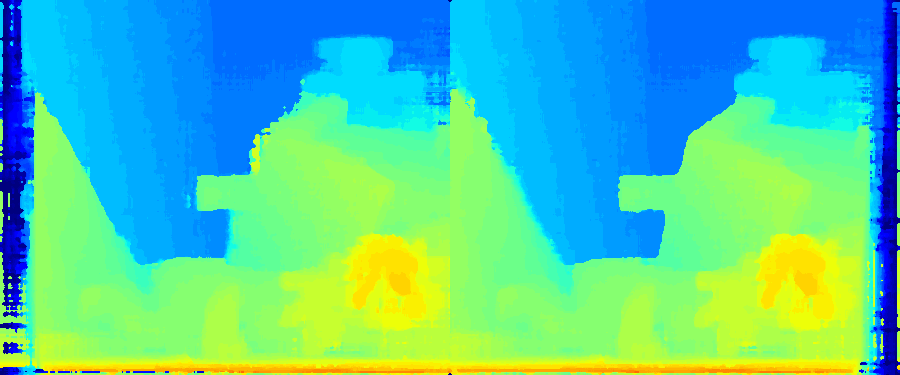
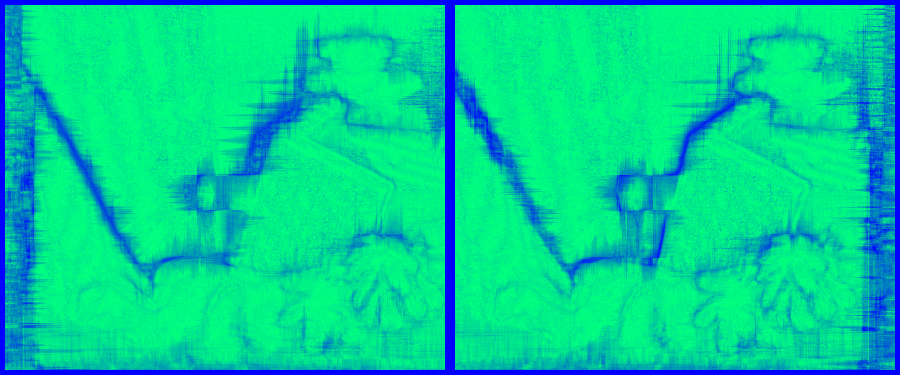
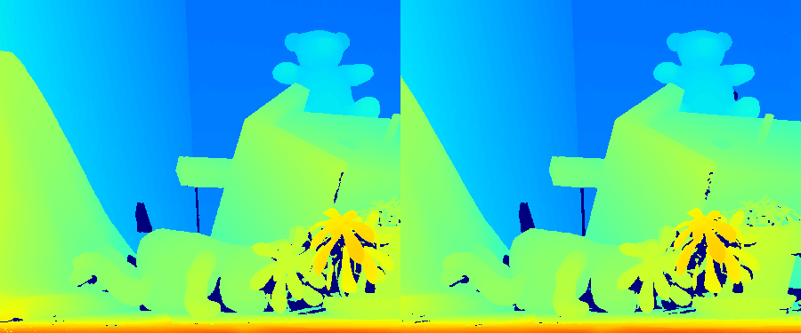
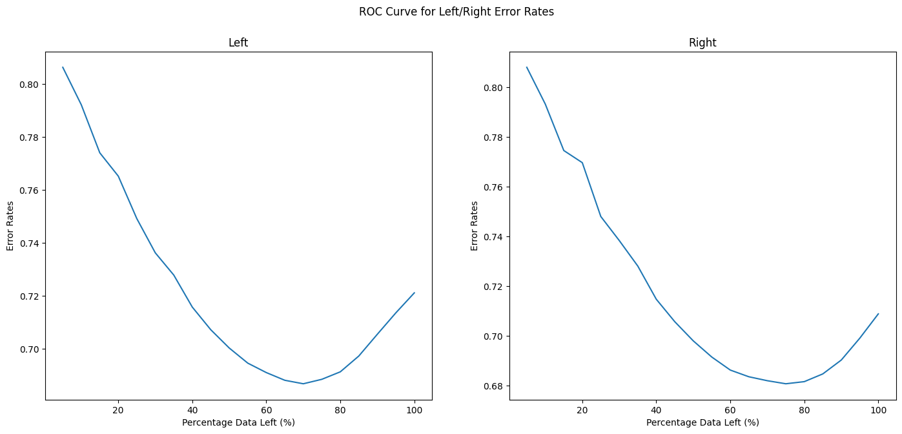
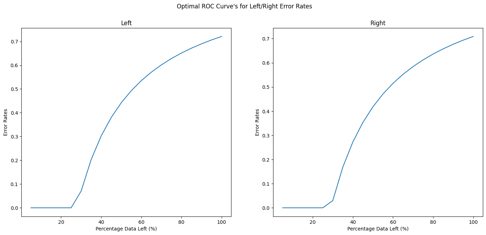
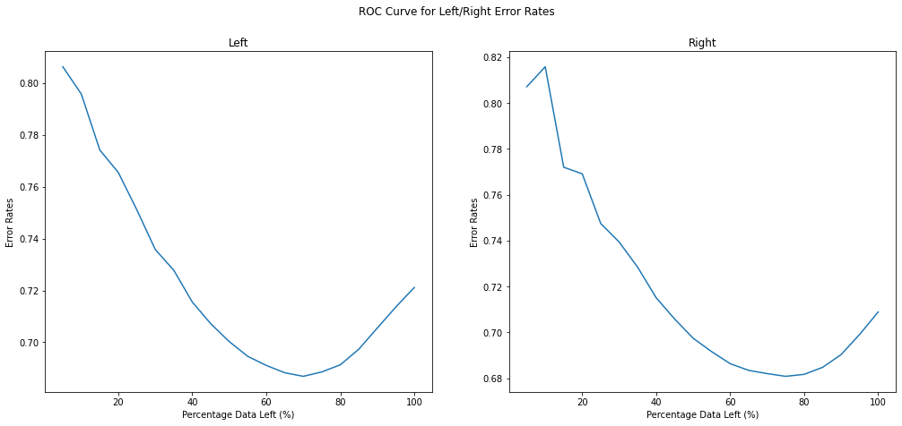
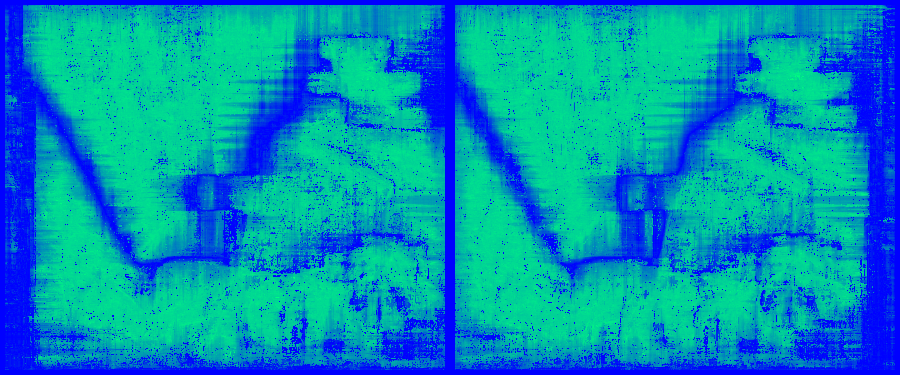
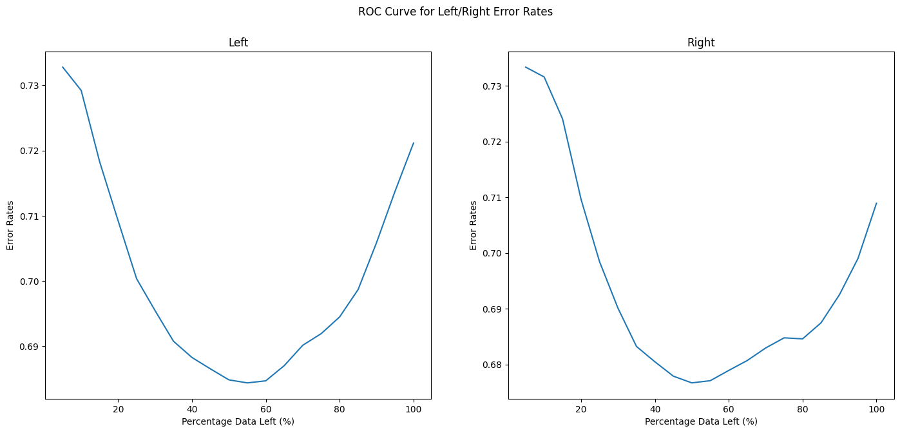
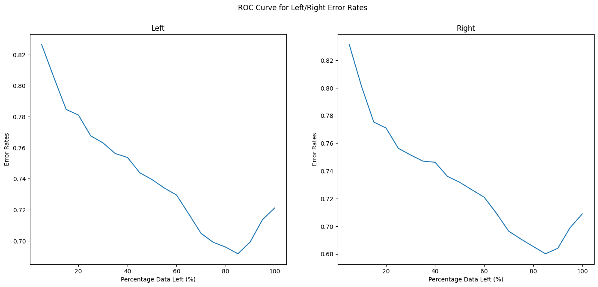

# Confidence Measures

## Introduction
The purpose of this repository is to showcase a series of handpicked confidence measures. All the confidence measures implemented in this repository can also be found in [On the confidence of stereo matching in a deep-learning era: a quantitative evaluation](https://arxiv.org/abs/2101.00431) by M. Poggi et al. There are no plans to add any learned confidence measures, as these are generally more complicated, therefore requiring more than a single notebook to implement. The same stereo matching algorithm, SGM, and the same example, teddy from Middlebury dataset, will be used for all examples, so the conditions remain consistent for all confidence measures. 

## Confidence Estimation Process
Each step shows the general process followed for each confidence estimation algorithm. I'm using the MSM measure for this example. 

1. Get Undistorted and Rectified Stereo Images

2. The stereo pair is converted to grayscale.

3. The depth map is calculated using the stereo algothithm. There will be multiple steps in this process, which will vary depending on the stereo algorithm used.

4. The confidence map is calculated from the depth map. Dark blue represents low confidence and light green represents high confidence.

5. **Testing phase only:** The confidence map is tested by checking if the pixels with low confidence correspond to an incorrect disparity prediction by comparing the predicted depth map with the ground truth shown below.

6. **Testing phase only:** To measure the accuracy of the confidence estimation algorithm we plot the ROC curve for the error rates shown below. The curve initially decreases before increasing, this indicates that the errors at the highest confidence levels are actually higher than at lower confidence levels. The lowest error rates are at about 70% density. This tells us how much data we need to filter out to achieve the lowest error rates. 

7. **Testing phase only:** For comparison heres what the optimal ROC error curve looks like. The optimal ROC Curve is based on the hypothetical situation where the confidence measure correctly identifies all incorrect disparities with low confidence and all correct matches with high confidence. This results in a monotonically increasing curve.

## Confidence Measure Groups:
Brief results of the confidence measures implemented thus far are shown below. See the respective notebooks for further details.

### 1. Minimum Cost and Local Properties:
#### Matching Score Measure (MSM):

- Requirements: A single cost volume.     
- AUC Left Score: 0.685.   
- AUC Right Score: 0.681.    
- Confidence Map: 
- ROC Curve: 

#### Maximum Margin (MM):

- Requirements: A single cost volume.     
- AUC Left Score: 0.664.   
- AUC Right Score: 0.658.    
- Confidence Map: 
- ROC Curve: 

### 2. Entire Cost Curve
None Yet.

### 3. Left-Right Consistency
#### Left-Right Consistency (LRC):

- Requirements: Left and right disparity maps.     
- AUC Left Score: 0.648.   
- AUC Right Score: 0.640.    
- Confidence Map: 
- ROC Curve: 

### 4. Disparity Map Analysis
None Yet.

### 5. Reference Image Analysis
None Yet.

### 6. Self-Matching
None Yet.

### 7. Semi-Global Matching Measures
None Yet.

## References
* [Matching Score Measure (MSM)](http://www.cse.yorku.ca/~wildes/wildesVI02.pdf) by G. Egnal, M. Mintz, and R. Wilde.
* [Maximum Margin (MM)](http://vision.deis.unibo.it/~ftosi/papers/iccv2017_review.pdf) by M. Poggi, F. Tosi, and S. Mattoccia.
* [Left-Right Consistency (LRC)](https://citeseerx.ist.psu.edu/viewdoc/download?doi=10.1.1.438.672&rep=rep1&type=pdf) by G. Egnal and R. P. Wildes.
