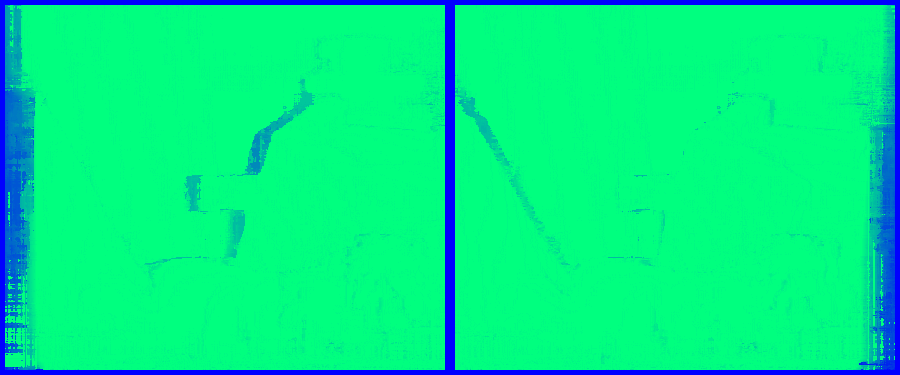

# Confidence Measures

## Introduction
The purpose of this repository is to showcase a series of handpicked confidence measures. All the confidence measures implemented in this repository can also be found in [On the confidence of stereo matching in a deep-learning era: a quantitative evaluation](https://arxiv.org/abs/2101.00431) by by M. Poggi et al. There are no plans to add any learned confidence measures, as these are generally more complicated, therefore requiring more than a single notebook to implement. The same stereo matching algorithm, SGM, and the same example, teddy from Middlebury dataset, will be used for all examples, so the conditions remain consistent for all confidence measures. 

## Confidence Measure Groups:
Brief results of the confidence measures implemented thus far are shown below. See the respective notebooks for further details.
### 1. Minimum Cost and Local Properties:
#### Matching Score Measure (MSM):

- Requirements: A single cost volume.     
- AUC Left Score: 0.685.   
- AUC Right Score: 0.681.    
- Confidence Map: 
- ROC Curve: 

#### Maximum Margin (MM):

- Requirements: A single cost volume.     
- AUC Left Score: 0.664.   
- AUC Right Score: 0.658.    
- Confidence Map: 
- ROC Curve: 

### 2. Entire Cost Curve
None Yet.

### 3. Left-Right Consistency
#### Left-Right Consistency (LRC):

- Requirements: Left and right disparity maps.     
- AUC Left Score: 0.648.   
- AUC Right Score: 0.640.    
- Confidence Map: 
- ROC Curve: 

### 4. Disparity Map Analysis
None Yet.

### 5. Reference Image Analysis
None Yet.

### 6. Self-Matching
None Yet.

### 7. Semi-Global Matching Measures
None Yet.

## References
* [Matching Score Measure (MSM)](http://www.cse.yorku.ca/~wildes/wildesVI02.pdf) by G. Egnal, M. Mintz, and R. Wilde.
* [Maximum Margin (MM)](http://vision.deis.unibo.it/~ftosi/papers/iccv2017_review.pdf) by M. Poggi, F. Tosi, and S. Mattoccia.
* [Left-Right Consistency (LRC)](https://citeseerx.ist.psu.edu/viewdoc/download?doi=10.1.1.438.672&rep=rep1&type=pdf) by G. Egnal and R. P. Wildes.
